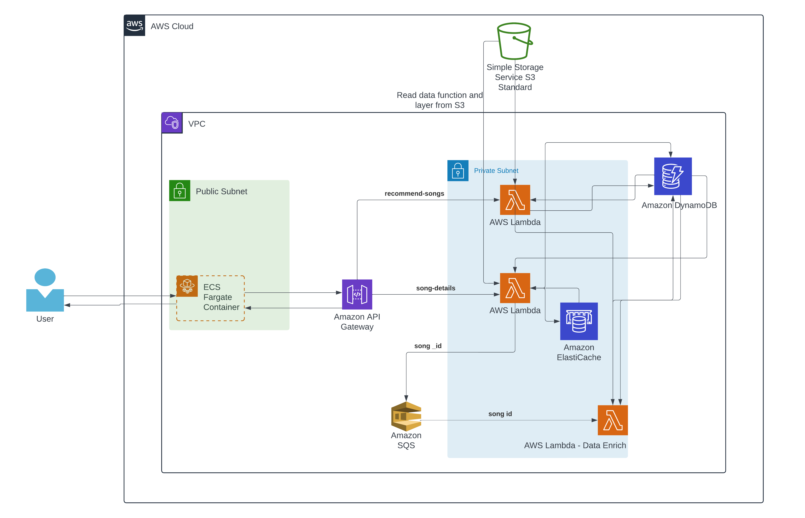

# Music Explore

## Abstract

Music Explore is an innovative cloud-native service that enables users to discover and enjoy music through lyrics. It employs serverless architecture and ETL operations to curate a rich database of song information, enhancing user engagement by appending YouTube watch URLs and Apple Music song preview links to song cards. The application provides a personalized user experience by featuring randomly selected song cards from previous searches on the home screen, promoting song rediscovery.

## Introduction

In today’s world, music enthusiasts are constantly seeking innovative platforms that facilitate seamless exploration and discovery of their favorite tunes. Music Explore aims to bring a personalized touch to the user experience by leveraging advanced cloud-native technologies. By caching frequently searched song queries and enriching song data with dynamic content, Music Explore offers a unique and engaging music discovery experience.

## DEMO VIDEO:
[Watch the Demo](https://drive.google.com/file/d/1PRhCotaE_aTnaTjU5phF7XRMoXBykRIF/view?usp=drive_link) 

## Cloud Native Project Architecture:

## List of Services Used

- **Compute Services:**
  - AWS Elastic Container Service (ECS) & Elastic Container Registry (ECR)
  - AWS Lambda

- **Storage Service:**
  - AWS DynamoDB
  - AWS S3

- **Network Services:**
  - AWS Virtual Private Cloud (VPC)
  - API Gateway

- **General Services:**
  - Amazon ElastiCache (Redis)
  - AWS SQS

## Explanation of Services

- **Why Chosen:**
  - ECS & ECR: Seamlessly deploy containerized frontend, ensuring scalability and reliability.
  - Lambda: Serverless backend operations for dynamic scaling and cost efficiency.
  - DynamoDB: Flexible, scalable NoSQL database for storing song information.
  - VPC: Ensures network isolation and security for backend operations.
  - API Gateway: Centralizes API management for efficient communication between frontend and backend.
  - ElastiCache: Improves performance by caching frequently accessed song data.
  - SQS: Provides asynchronous message queuing for scalable and reliable backend processing.

## Deployment & Delivery Model

- **Deployment Model:** Public cloud for scalability and reliability, leveraging AWS services.
- **Delivery Model:** Platform as a Service (PaaS) & Function as a Service (FaaS) for managed infrastructure and rapid development.

## Data Storage & Programming Languages

- **Data Storage:** DynamoDB for persistent storage of song information, Redis Cache for temporary data caching.
- **Languages Used:** JavaScript/TypeScript for frontend (Angular), Python for backend (AWS Lambda), ensuring robustness and scalability.

## Deployment to Cloud

- **Deployment:** Entire system deployed using AWS CloudFormation, enabling infrastructure as code and automated provisioning.
- **Serverless Architecture:** Leveraging AWS Lambda for backend processing and ECS Fargate for frontend deployment, achieving cost efficiency and scalability.

## Additional Details

- **Data Enrichment:** Music Explore enriches song data with YouTube watch URLs and Apple Music song preview links, providing users with dynamic content.
- **Personalization:** The application's home screen features randomly selected song cards from the user's previous searches, fostering a sense of familiarity and discovery.
- **Security:** Utilizing AWS VPC for network isolation and fine-grained access control ensures data security and compliance.
- **Scalability:** Leveraging AWS services such as Lambda and DynamoDB allows Music Explore to scale seamlessly based on demand, ensuring optimal performance for users.
- **Cost Efficiency:** By adopting serverless architecture and leveraging managed services, Music Explore minimizes operational overhead and infrastructure costs.

